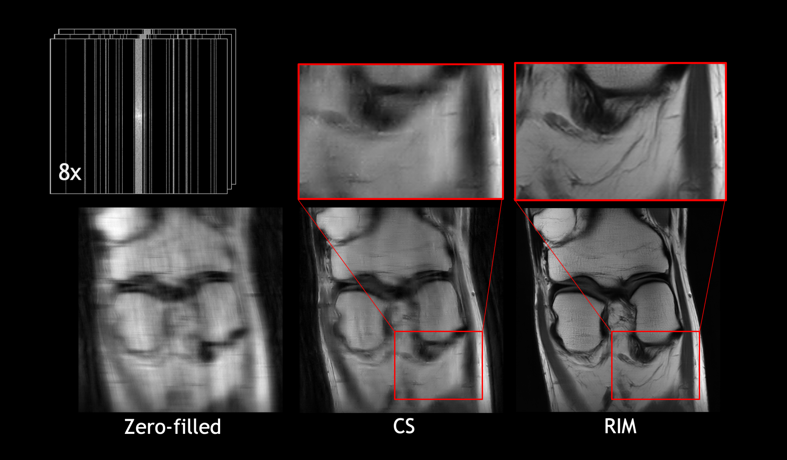

[](https://travis-ci.org/directgroup/direct)
# DIRECT
DIRECT is the Deep Image REConstruction Toolkit that implements state-of-the-art inverse problem solvers. It includes
the Recurrent Inference Machine, which was part of the winning solution in Facebook & NYUs FastMRI challenge in 2019 and the Calgary-Campinas MRI reconstruction challenge at MIDL 2020.

<div align="center">
  
</div>

## Installation
See [install.md](install.md).

## Quick Start
See [getting_started.md](getting_started.md), check out the [documentation](https://direct.readthedocs.io/).
In the [projects](projects) folder examples are given on how to train models on public datasets.

## Baselines and trained models.
We intend to provide a set of baseline results and trained models in the [DIRECT Model Zoo](model_zoo.md).

## License
DIRECT is released under the [Apache 2.0 License](LICENSE).

## Citing DIRECT
If you use DIRECT in your own research, or want to refer to baseline results published in the
 [DIRECT Model Zoo](model_zoo.md), please use the following BiBTeX entry:

```BibTeX
@misc{DIRECTTOOLKIT,
  author =       {Jonas Teuwen, Nikita Moriakov, Dimitrios Karkalousos, Matthan Caan},
  title =        {DIRECT},
  howpublished = {\url{https://github.com/directgroup/direct}},
  year =         {2020}
}
```

