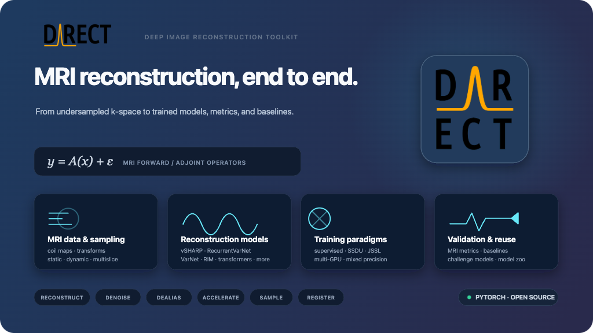

=========================================
DIRECT: Deep Image REConstruction Toolkit
=========================================

|PyPI| |JOSS| |Tests| |Ruff| |Codacy| |Codecov|

`Installation <https://docs.aiforoncology.nl/direct/installation.html>`__ ·
`Quick start <https://docs.aiforoncology.nl/direct/getting_started.html>`__ ·
`Documentation <https://docs.aiforoncology.nl/direct/index.html>`__ ·
`Model zoo <https://docs.aiforoncology.nl/direct/model_zoo.html>`__ ·
`Papers <https://docs.aiforoncology.nl/direct/papers.html>`__

``DIRECT`` is a PyTorch toolkit for accelerated MRI reconstruction.
It takes undersampled multi-coil k-space through sampling, reconstruction,
optional registration, metrics, and pretrained baselines — end to end.

Challenge-winning models shipped in DIRECT include vSHARP (CMRxRecon 2023),
RecurrentVarNet (Calgary-Campinas / MIDL 2020), and RIM (fastMRI 2019).

Features
--------

* **MRI data and sampling.** Multi-coil static, dynamic, and multislice
  volumes; coil-sensitivity estimation; and a library of Cartesian, radial,
  spiral, Poisson, Gaussian, and k-t masks. A learned Adaptive Dynamic
  Sampler (ADS) can also choose lines or pixels under a fixed acceleration
  budget.
* **Reconstruction models.** vSHARP, RecurrentVarNet, VarNet, RIM / CIRIM,
  LPDNet, XPDNet, IterDualNet, ConjGradNet, Joint-ICNet, KIKI-Net,
  MultiDomainNet, VarSplitNet, U-Net (2D / 3D), MEDL, and transformer
  reconstructors (ViT, UFormer) in image or k-space.
* **Training paradigms.** Fully supervised learning, self-supervised SSDU, and
  JSSL (joint supervised + self-supervised). Distributed multi-GPU training,
  mixed precision, and TensorBoard logging.
* **Conditional and joint pipelines.** Modulated convolutions condition an
  unrolled network on acceleration and ACS fraction. Optional registration
  (learned or classical) aligns dynamic frames with reconstruction.
* **Validation and reuse.** MRI metrics (SSIM, pSNR, NMSE, VIF, HFEN, …),
  YAML configs, ``direct train`` / ``direct predict``, and a
  `model zoo on Hugging Face <https://huggingface.co/NKI-AI>`__.

Install
-------

PyPI package name is ``direct-recon`` (import as ``direct``):

.. code-block:: bash

   pip install direct-recon

Development install with `uv <https://docs.astral.sh/uv/>`__:

.. code-block:: bash

   git clone https://github.com/NKI-AI/direct.git
   cd direct
   uv sync

See the `installation guide <https://docs.aiforoncology.nl/direct/installation.html>`__
for Docker and conda.

Projects and model zoo
----------------------

Reproducible experiment configs live under
`projects/ <https://github.com/NKI-AI/direct/tree/main/projects>`__.
Pretrained ``.yaml`` / ``.pt`` pairs are on Hugging Face
(`NKI-AI <https://huggingface.co/NKI-AI>`__) and listed in the
`model zoo <https://docs.aiforoncology.nl/direct/model_zoo.html>`__.

.. code-block:: bash

   pip install huggingface_hub
   hf download NKI-AI/direct-calgary-campinas --local-dir ./calgary

   direct predict ./predictions \
       --cfg ./calgary/rim_5x.yaml \
       --checkpoint ./calgary/rim_5x.pt \
       --data-root /path/to/calgary_campinas \
       --num-gpus 1

License
-------

DIRECT is not intended for clinical use. It is released under the
`Apache 2.0 License <LICENSE>`__.

Citing DIRECT
-------------

If you use DIRECT, please cite the toolkit paper. Method-specific BibTeX
entries are collected on the
`papers page <https://docs.aiforoncology.nl/direct/papers.html>`__.

.. code-block:: bibtex

   @article{DIRECTTOOLKIT,
       doi       = {10.21105/joss.04278},
       url       = {https://doi.org/10.21105/joss.04278},
       year      = {2022},
       publisher = {The Open Journal},
       volume    = {7},
       number    = {73},
       pages     = {4278},
       author    = {George Yiasemis and Nikita Moriakov and Dimitrios Karkalousos and Matthan Caan and Jonas Teuwen},
       title     = {DIRECT: Deep Image REConstruction Toolkit},
       journal   = {Journal of Open Source Software}
   }

.. |PyPI| image:: https://img.shields.io/pypi/v/direct-recon.png
   :target: https://pypi.org/project/direct-recon/
   :alt: PyPI
.. |JOSS| image:: https://img.shields.io/badge/JOSS-10.21105%2Fjoss.04278-blue.png
   :target: https://doi.org/10.21105/joss.04278
   :alt: JOSS
.. |Tests| image:: https://img.shields.io/github/actions/workflow/status/NKI-AI/direct/tests.yml.png?label=Tests
   :target: https://github.com/NKI-AI/direct/actions/workflows/tests.yml
   :alt: Tests
.. |Ruff| image:: https://img.shields.io/github/actions/workflow/status/NKI-AI/direct/ruff.yml.png?label=Ruff
   :target: https://github.com/NKI-AI/direct/actions/workflows/ruff.yml
   :alt: Ruff
.. |Codacy| image:: https://api.codacy.com/project/badge/Grade/1c55d497dead4df69d6f256da51c98b7
   :target: https://app.codacy.com/gh/NKI-AI/direct
   :alt: Codacy
.. |Codecov| image:: https://img.shields.io/codecov/c/github/NKI-AI/direct.png
   :target: https://codecov.io/gh/NKI-AI/direct
   :alt: Codecov
