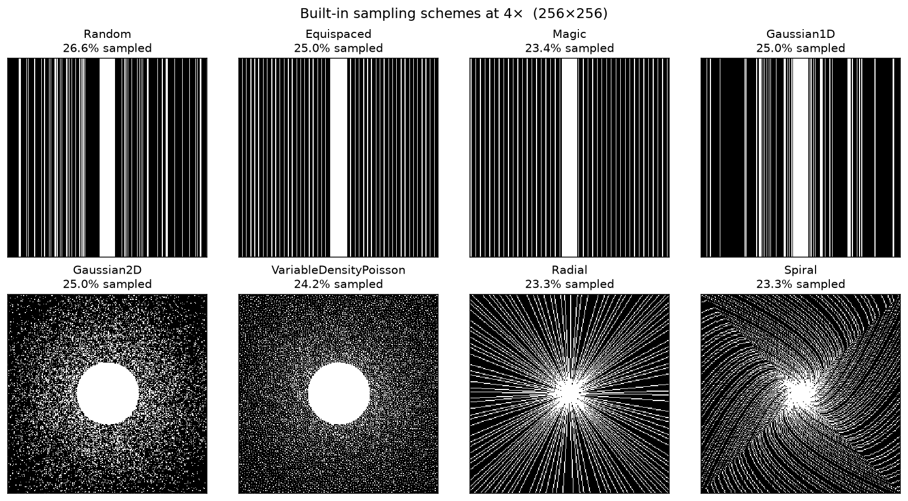

===========================
Retrospective sampling masks
===========================

MRI reconstruction in :code:`DIRECT` is typically trained on fully sampled Cartesian k-space that is **retrospectively
undersampled**. A sampling mask is a binary array that keeps a subset of k-space locations (the acquired samples) and
zeros the rest. The acceleration factor :math:`R` is the ratio of the full grid size to the number of retained samples:
:math:`R = 4` keeps about 25 % of k-space.

This tutorial shows how to pick a built-in scheme, generate a mask in Python, and wire it into a training YAML.
To implement a **new** scheme, see :doc:`../samplers`. The schemes below are studied in
:doc:`../papers` (Yiasemis et al., *On retrospective k-space subsampling schemes*, 2024).

Built-in schemes
================

:func:`direct.common.subsample.build_masking_function` looks up ``name + "MaskFunc"`` in
:mod:`direct.common.subsample`. The YAML ``masking.name`` is that short name.

.. list-table::
   :header-rows: 1
   :widths: 22 28 50

   * - YAML ``name``
     - Class
     - Pattern
   * - ``Random``
     - :class:`~direct.common.subsample.RandomMaskFunc`
     - Vertical Cartesian lines, uniformly at random, plus a fully sampled ACS band
   * - ``FastMRIRandom``
     - :class:`~direct.common.subsample.FastMRIRandomMaskFunc`
     - Same as ``Random``, with ``center_fractions`` as a **fraction** of columns (fastMRI convention)
   * - ``CartesianRandom``
     - :class:`~direct.common.subsample.CartesianRandomMaskFunc`
     - Same as ``Random``, with ``center_fractions`` as an **integer** line count
   * - ``Equispaced`` / ``FastMRIEquispaced`` / ``CartesianEquispaced``
     - :class:`~direct.common.subsample.EquispacedMaskFunc`
     - Equally spaced vertical lines plus ACS
   * - ``Magic`` / ``FastMRIMagic`` / ``CartesianMagic``
     - :class:`~direct.common.subsample.MagicMaskFunc`
     - Golden-ratio (``φ``) offset vertical lines
   * - ``Gaussian1D``
     - :class:`~direct.common.subsample.Gaussian1DMaskFunc`
     - Vertical lines drawn from a Gaussian density peaked at the k-space center
   * - ``Gaussian2D``
     - :class:`~direct.common.subsample.Gaussian2DMaskFunc`
     - 2D Gaussian density over the k-space plane
   * - ``VariableDensityPoisson``
     - :class:`~direct.common.subsample.VariableDensityPoissonMaskFunc`
     - 2D Poisson-disk sampling with a fully sampled central disk
   * - ``Radial`` / ``Spiral``
     - :class:`~direct.common.subsample.RadialMaskFunc`, :class:`~direct.common.subsample.SpiralMaskFunc`
     - CIRCUS radial / spiral trajectories on a Cartesian grid
   * - ``CalgaryCampinas``
     - :class:`~direct.common.subsample.CalgaryCampinasMaskFunc`
     - Challenge Poisson-disk masks (only :math:`R \in \{5, 10\}` and shapes ``218×170/174/180``)
   * - ``KtRadial`` / ``KtUniform`` / ``KtGaussian1D``
     - :class:`~direct.common.subsample.KtRadialMaskFunc` and siblings
     - Dynamic :math:`k`-:math:`t` sampling (one mask per time frame)

``FastMRI*`` variants take ``center_fractions`` in ``(0, 1)``. ``Cartesian*`` variants take an integer number of
center lines. The unsuffixed ``Random`` / ``Equispaced`` / ``Magic`` classes accept either: a value ``< 1`` is a
fraction, an integer ``>= 1`` is a line count.

Generate a mask in Python
=========================

The factory is the same object the training loop builds from YAML:

.. code-block:: python

    from direct.common.subsample import build_masking_function
    from direct.data.transforms import apply_mask

    mask_func = build_masking_function(
        name="Random",
        accelerations=[4],
        center_fractions=[0.08],
        range_mode="discrete",
    )

    # Shape is at least 3-D. Samples are drawn along the second-last axis (width).
    # A typical fully sampled slice is (height, width, complex=2).
    mask = mask_func((320, 320, 2), seed=0)
    print(mask.shape, mask.dtype)  # (1, 320, 320, 1)  bool

    # Apply the same mask to multi-coil k-space of shape (coil, height, width, 2):
    # masked_kspace, mask = apply_mask(kspace, mask_func, seed=0)

``seed`` makes the draw reproducible. Without a seed, a new mask is sampled on every call (useful during training).

The returned mask has a leading coil axis of size ``1`` so it broadcasts over coils. Squeeze it for plotting:

.. code-block:: python

    import matplotlib.pyplot as plt

    plt.imshow(mask.squeeze(), cmap="gray", origin="lower")
    plt.axis("off")
    plt.show()

   Built-in schemes at 4× on a ``256×256`` grid (seed ``0``). Titles report the realized sampled fraction.

Acceleration, ACS, and ``range_mode``
=====================================

* **``accelerations``**: target undersampling factor. Several values are allowed; with
  ``range_mode: discrete`` one pair is chosen uniformly each call. Example: ``accelerations: [4, 8]`` with
  ``center_fractions: [0.08, 0.04]``.
* **``center_fractions``**: autocalibration-signal (ACS) width. Low-frequency columns (1D schemes) or a centered
  disk (2D schemes) are always sampled so sensitivity maps can be estimated.
* **``range_mode``**:

  * ``discrete`` — pick one of the configured ``(acceleration, center_fraction)`` pairs.
  * ``uniform`` — sample both values uniformly between the two endpoints (length must be 2).
  * ``linear`` — triangular distribution biased toward **higher** acceleration.

Request the ACS region on its own with ``return_acs=True``. That mask is what
``estimate_sensitivity_maps: true`` uses internally:

.. code-block:: python

    acs = mask_func((320, 320, 2), seed=0, return_acs=True)

Pass ``return_acceleration=True`` to also recover the realized ``(acceleration, center_fraction)`` for that draw.

Static, dynamic, and multislice
===============================

``mode`` controls whether one mask is reused or a new mask is drawn along the fourth-last axis:

* ``static`` (default) — one mask, broadcast over time / slice.
* ``dynamic`` — independent mask per time frame. Shape must be at least 4-D, e.g. ``(nt, height, width, 2)``.
* ``multislice`` — independent mask per slice, same shape convention as ``dynamic``.

.. code-block:: python

    dynamic = build_masking_function(
        name="Random",
        accelerations=[4],
        center_fractions=[0.08],
        range_mode="discrete",
        mode="dynamic",
    )
    masks = dynamic((8, 320, 320, 2), seed=0)  # (1, 8, 320, 320, 1)

The ``Kt*`` classes are dynamic by construction (radial / uniform / Gaussian sampling in :math:`k`-:math:`t`).

.. figure:: ../_static/tutorials/sampling_masks_dynamic.png
   :alt: Four dynamic random-line frames plus a static sampling mask and its ACS region
   :align: center

   Left: four time frames of a ``mode: dynamic`` random-line mask. Right: a static sampling mask and the ACS
   region returned by ``return_acs=True``.

YAML in a training config
=========================

Under each dataset, set ``transforms.masking``. The training engine calls
:func:`~direct.common.subsample.build_masking_function` with that mapping:

.. code-block:: yaml

    training:
      datasets:
        - name: FastMRI
          filenames_lists:
            - ../lists/train.lst
          transforms:
            cropping:
              crop: null
            sensitivity_map_estimation:
              estimate_sensitivity_maps: true
            normalization:
              scaling_key: masked_kspace
            masking:
              name: FastMRIRandom
              accelerations: [4, 8]
              center_fractions: [0.08, 0.04]
              range_mode: discrete
              mode: static

CIRCUS radial / spiral only need an acceleration list (ACS is inferred from the trajectory unless you set
``center_fractions``):

.. code-block:: yaml

    masking:
      name: Radial
      accelerations: [5, 10]

Calgary-Campinas challenge masks
================================

:class:`~direct.common.subsample.CalgaryCampinasMaskFunc` does not synthesize a pattern: it downloads the official
Poisson-disk masks from Hugging Face and caches them locally (``direct.environment.DIRECT_CACHE_DIR``). Only
accelerations ``5`` and ``10`` and k-space shapes ``218×170``, ``218×174``, and ``218×180`` are valid.

.. code-block:: python

    from direct.common.subsample import CalgaryCampinasMaskFunc

    mask_func = CalgaryCampinasMaskFunc(accelerations=[5, 10])
    mask = mask_func((218, 180, 2), seed=0)

See :doc:`../examples` for a full dataset walk-through, and :doc:`../calgary_campinas` for the reconstruction
challenge project.
