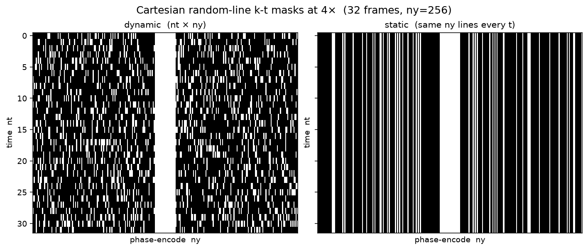

===============================
Static vs dynamic reconstruction
===============================

Two different things are easy to mix up:

* **Reconstruction dimensionality** — is each network input one 2D slice, or a 2D+time / 3D volume?
* **Sampling-mask mode** — is the undersampling pattern the same for every frame, or a new pattern per frame?

This page covers both. For the catalog of mask *patterns* (random lines, Poisson, CIRCUS, …), see
:doc:`sampling_masks`.

Tensor shapes
=============

Complex k-space is stored with a trailing real/imag axis of size ``2``. After the MRI transforms, a training sample
looks like:

.. list-table::
   :header-rows: 1
   :widths: 22 18 28 32

   * - Setting
     - Dataset ``ndim``
     - ``kspace`` / ``masked_kspace``
     - Typical use
   * - Static 2D
     - ``2``
     - ``(coil, height, width, 2)``
     - FastMRI / Calgary-Campinas slice-wise training
   * - Dynamic 2D+time
     - ``3``
     - ``(coil, time, height, width, 2)``
     - Cine, CMRxRecon with ``kspace_context: time``
   * - Multislice 3D
     - ``3``
     - ``(coil, slice, height, width, 2)``
     - Volumetric data with ``kspace_context: slice``

The engine reads ``dataset.ndim`` and sets FFT axes accordingly (height/width). A 2D model such as
:class:`~direct.nn.unet.unet_2d.Unet2d` expects ``ndim == 2``. A 3D model such as
:class:`~direct.nn.varnet.varnet.EndToEndVarNet3D` expects ``ndim == 3``.

How the dataset chooses 2D vs 3D
================================

**FakeMRIBlobs / cine-style loaders.** Leave ``kspace_context`` unset to emit one 2D slice per item. Set
``kspace_context: time`` (or any truthy value on :class:`~direct.data.datasets.FakeMRIBlobsDataset`) to emit a full
volume per item.

**CMRxRecon.** ``kspace_context: null`` is 2D; ``time`` is 2D+t; ``slice`` is 3D through-plane. See :doc:`../cmrxrecon`.

**FastMRI H5.** ``kspace_context`` is an integer number of neighbouring slices stacked around the current slice
(``0`` keeps 2D).

Sampling: static mask vs per-frame mask
=======================================

This is independent of the model. On a 2D+t volume you can still reuse **one** mask for every frame
(``masking.mode: static``, the default): the mask broadcasts along time. Or you can draw an independent mask per
frame (``masking.mode: dynamic``). The ``Kt*`` schemes are dynamic by construction. Adaptive sampling uses
``transforms.dynamic_mask: true`` instead; see :doc:`../e2e_ads_recon`.

   ``mode: dynamic`` draws a new random-line pattern per time frame (left). A static mask is one pattern reused
   for the whole volume.

Static 2D experiment
====================

The config below trains a tiny U-Net on synthetic 2D slices (no data download). Each dataset item is one slice;
``spatial_shape: [4, 32, 32]`` means four slices of ``32×32``, so the dataset length is
``sample_size × 4``.

.. literalinclude:: cfgs/static_recon.yaml
   :language: yaml

Run it:

.. code-block:: bash

    direct train <experiment_directory> --cfg docs/tutorials/cfgs/static_recon.yaml \
        --num-gpus 1 --device cpu --num-workers 0 --name smoke

The engine log should contain ``Data dimensionality: 2.`` and use :class:`~direct.nn.unet.unet_engine.Unet2dEngine`.

Dynamic 2D+time experiment
==========================

The same synthetic generator, but ``kspace_context: time`` so each item is a cine volume of eight frames, and
``masking.mode: dynamic`` so each frame gets its own random-line mask. The model is a 1-cascade 3D VarNet.

.. literalinclude:: cfgs/dynamic_recon.yaml
   :language: yaml

.. code-block:: bash

    direct train <experiment_directory> --cfg docs/tutorials/cfgs/dynamic_recon.yaml \
        --num-gpus 1 --device cpu --num-workers 0 --name smoke

The engine log should contain ``Data dimensionality: 3.`` and use
:class:`~direct.nn.varnet.varnet_engine.EndToEndVarNet3DEngine`. Dataset length equals ``sample_size`` (one item per
volume), not ``sample_size × time``.

Checklist
=========

* 2D recon → 2D model (``Unet2d``, ``EndToEndVarNet``, RecurrentVarNet, …) and **no** ``kspace_context`` (or ``0``).
* 2D+t / 3D recon → 3D model (``EndToEndVarNet3D``, ``VSharpNet3D``, …) and ``kspace_context: time`` or ``slice``.
* Same undersampling on every frame → ``masking.mode: static``.
* Time-varying undersampling → ``masking.mode: dynamic`` or a ``Kt*`` scheme.
* Do not feed 5-D k-space to a 2D engine; ``ndim`` comes from the dataset, not from the YAML model name.
