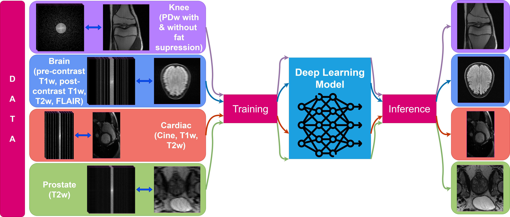
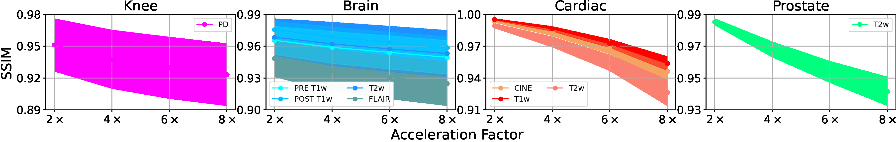
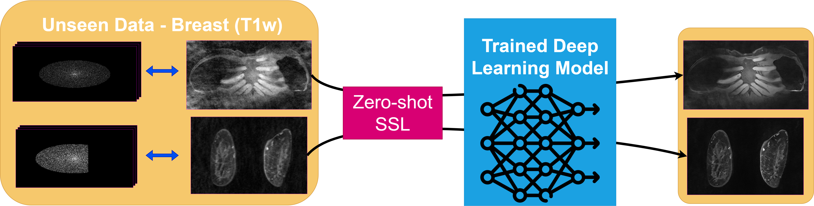

================================================================================
UNIFORM: Unified Deep Learning for Multi-organ / Multi-contrast MRI Reconstruction
================================================================================

Accepted at **MIDL 2025** (short paper):

  `UNIFORM: A Unified Deep Learning Framework for Multi-organ and Multi-contrast MRI Reconstruction <https://openreview.net/forum?id=I13Y1nU6gs>`__
  (`PDF <https://openreview.net/pdf?id=I13Y1nU6gs>`__)

UNIFORM trains **one** `vSHARP <https://arxiv.org/abs/2309.09954>`__ model on multi-coil k-space
from fastMRI brain, knee, and prostate plus CMRxRecon cardiac data. At inference it reconstructs
undersampled multi-coil MRI across those anatomies and contrasts, with retrospective
accelerations :math:`R \in \{2,4,6,8\}`. The paper also reports zero-shot self-supervised
learning (ZS-SSL) on prospectively undersampled breast T1w data at 10× and 17×.

   Figure 1 from the paper: UNIFORM training and inference pipeline.

   Figure 2 from the paper: quantitative SSIM on knee, brain, cardiac, and prostate test data.

   Figure 3 from the paper: zero-shot SSL on unseen breast T1w data (10× and 17×).

Paper & resources
=================

* OpenReview forum: https://openreview.net/forum?id=I13Y1nU6gs
* OpenReview PDF: https://openreview.net/pdf?id=I13Y1nU6gs
* Pretrained weights + inference YAMLs (Hub): https://huggingface.co/NKI-AI/direct-uniform
* vSHARP method paper: https://doi.org/10.1016/j.mri.2024.110266 · https://arxiv.org/abs/2309.09954
* DIRECT toolkit: https://github.com/NKI-AI/direct

Training data (from the paper)
==============================

=================== ======================================================== ======= ============= =======
Dataset             Contrasts                                                Train   Validation    Test
=================== ======================================================== ======= ============= =======
fastMRI Knee        PD with & without fat suppression                        973     100           99
fastMRI Brain       T1w, T2w, FLAIR                                          4284    1577          557
fastMRI Prostate    T2w                                                      218     48            46
CMRxRecon Cardiac   Cine, T1w, T2w                                           203     229           373
=================== ======================================================== ======= ============= =======

Model
=====

* Architecture: ``vsharp.vsharp.VSharpNet`` with a **U-Net** image prior
* 12 ADMM steps, no parameter sharing between steps
* Sensitivity network: 2D U-Net (32 filters, 4 pool layers)
* Trained ~420k iterations (validation metrics converged); Adam with default vSHARP settings
* Inference configs set ``image_unet_conv_out_bias: true`` (required for the released weights)

Quick start (inference)
=======================

.. code-block:: bash

   pip install huggingface_hub
   hf download NKI-AI/direct-uniform --local-dir ./uniform

   # Brain — 4× random (default YAML)
   direct predict ./preds/brain \
     --cfg ./uniform/uniform_brain.yaml \
     --checkpoint ./uniform/uniform_vsharp.pt \
     --data-root /path/to/fastmri/brain/multicoil_val \
     --filenames-filter projects/UNIFORM/lists/test/brain_4x.lst \
     --num-gpus 1

   # Knee / prostate — 4× equispaced
   direct predict ./preds/knee \
     --cfg ./uniform/uniform_knee.yaml \
     --checkpoint ./uniform/uniform_vsharp.pt \
     --data-root /path/to/fastmri/knee/multicoil_val \
     --filenames-filter projects/UNIFORM/lists/test/knee_4x.lst \
     --num-gpus 1

   # Cardiac — CMRxRecon ValidationSet FullSample (flatten to P0XX_cine_*.mat)
   direct predict ./preds/cardiac \
     --cfg ./uniform/uniform_cardiac.yaml \
     --checkpoint ./uniform/uniform_vsharp.pt \
     --data-root /path/to/cmrxrecon/ValidationSet/FullSample_flat \
     --filenames-filter projects/UNIFORM/lists/test/cardiac_4x.lst \
     --num-gpus 1

``--filenames-filter`` takes a path to a ``.lst`` file of basenames (resolved under
``--data-root``). Unlike training/validation, inference does not use ``filenames_lists``
in the YAML.

Change acceleration by editing ``inference.dataset.transforms.masking`` — uncomment **one**
``accelerations`` / ``center_fractions`` pair (always keep single-element lists at inference):

.. code-block:: yaml

   masking:
     name: FastMRIEquispaced   # brain default YAML uses FastMRIRandom
     # accelerations: [8]
     # center_fractions: [0.04]
     accelerations: [4]
     center_fractions: [0.08]

======= =============== ==================
:math:`R` accelerations center_fractions
======= =============== ==================
2×      ``[2]``         ``[0.1]``
4×      ``[4]``         ``[0.08]``
6×      ``[6]``         ``[0.06]``
8×      ``[8]``         ``[0.04]``
======= =============== ==================

Project layout
==============

=============================== ==========================================================
Path                            Description
=============================== ==========================================================
``configs/train_uniform.yaml``  Multi-anatomy training config (current DIRECT format)
``configs/inference/``          Per-anatomy inference YAMLs (4× defaults; ``*_8x.yaml``)
``huggingface/``                Hub package (README, YAMLs, paper figures)
``tools/convert_uniform_checkpoint.py``  Legacy → current state_dict remapper
``tools/convert_legacy_config.py``       Flat → nested transforms helper
``lists/test/``                 Small filename lists for smoke tests
``jobs/``                       Example sbatch scripts (Kosmos)
=============================== ==========================================================

Training
========

Training lists are referenced from ``configs/`` as ``../lists/...``. Many lists overlap
with ``projects/JSSL/lists/``; symlink or copy them before launching:

.. code-block:: bash

   direct train ./experiments/uniform \
     --cfg projects/UNIFORM/configs/train_uniform.yaml \
     --num-gpus 8

See `Training <https://docs.aiforoncology.nl/direct/training.html>`__.

Cardiac data note
=================

For metric checks matching the paper / original Kosmos run, use CMRxRecon
**ValidationSet/FullSample** (e.g. P038 sax shape with phase-encode ``246``), not
TrainingSet FullSample (``162``). Flatten patient folders to ``P038_cine_sax.mat``-style
names for the CMRxRecon dataset loader.

Citing this work
================

.. code-block:: bibtex

   @inproceedings{Yiasemis_UNIFORM,
       title     = {{UNIFORM}: A Unified Deep Learning Framework for Multi-organ and Multi-contrast {MRI} Reconstruction},
       author    = {Yiasemis, George and Ferm, Jonatan and Moriakov, Nikita and Mann, Ritse M. and Sonke, Jan-Jakob and Teuwen, Jonas},
       booktitle = {Medical Imaging with Deep Learning},
       year      = {2025},
       url       = {https://openreview.net/forum?id=I13Y1nU6gs}
   }

   @article{Yiasemis_2025_vSHARP,
       title   = {vSHARP: Variable Splitting Half-quadratic ADMM algorithm for reconstruction of inverse-problems},
       author  = {Yiasemis, George and Moriakov, Nikita and Sonke, Jan-Jakob and Teuwen, Jonas},
       journal = {Magnetic Resonance Imaging},
       volume  = {115},
       pages   = {110266},
       year    = {2025},
       doi     = {10.1016/j.mri.2024.110266}
   }

   @article{DIRECTTOOLKIT,
       doi       = {10.21105/joss.04278},
       url       = {https://doi.org/10.21105/joss.04278},
       year      = {2022},
       publisher = {The Open Journal},
       volume    = {7},
       number    = {73},
       pages     = {4278},
       author    = {George Yiasemis and Nikita Moriakov and Dimitrios Karkalousos and Matthan Caan and Jonas Teuwen},
       title     = {DIRECT: Deep Image REConstruction Toolkit},
       journal   = {Journal of Open Source Software}
   }
