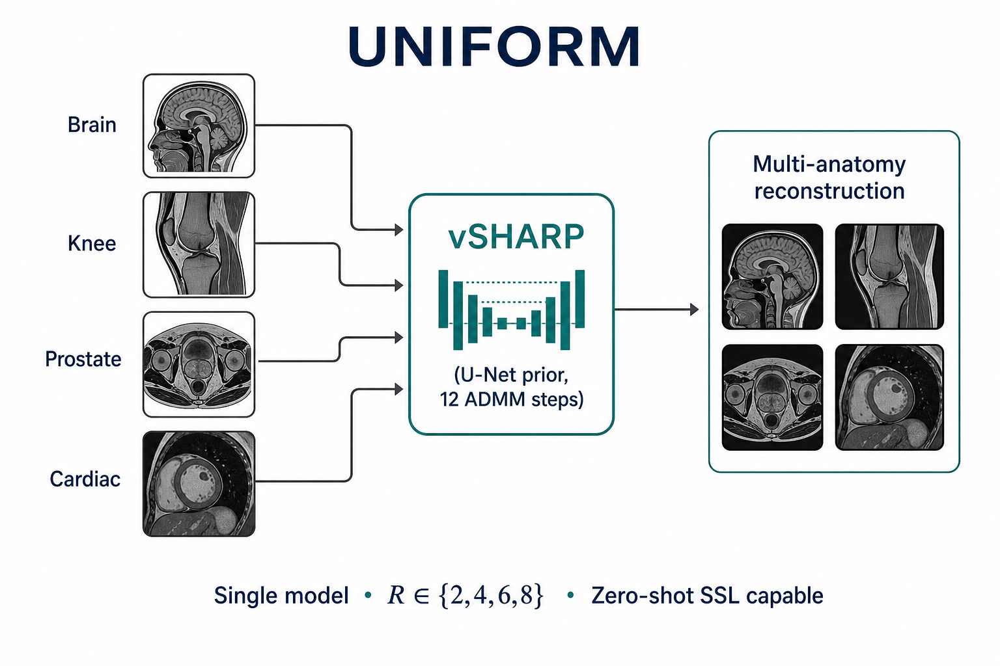

# DIRECT — UNIFORM multi-anatomy vSHARP

**UNIFORM** is a *single* deep MRI reconstructor trained jointly across organs and contrasts,
built on [vSHARP](https://arxiv.org/abs/2309.09954) inside the
[DIRECT](https://github.com/NKI-AI/direct) toolkit.

📄 **Paper (primary):** [UNIFORM: A Unified Deep Learning Framework for Multi-organ and Multi-contrast MRI Reconstruction](https://openreview.net/forum?id=I13Y1nU6gs) · [PDF](https://openreview.net/pdf?id=I13Y1nU6gs)  
🏗️ **Method:** [vSHARP (MRI, 2025)](https://doi.org/10.1016/j.mri.2024.110266) · [arXiv:2309.09954](https://arxiv.org/abs/2309.09954)  
💻 **Code:** [`projects/UNIFORM`](https://github.com/NKI-AI/direct/tree/main/projects/UNIFORM) in [NKI-AI/direct](https://github.com/NKI-AI/direct)



*One model for brain, knee, prostate, and cardiac multi-coil reconstruction
(\(R\in\{2,4,6,8\}\); zero-shot SSL for unseen anatomies in the paper).*

## What is in this repo?

| File | Role |
|------|------|
| `uniform_vsharp.pt` | Pretrained weights — use with the YAMLs below |
| `uniform_brain.yaml` | Brain inference (default **4×** FastMRIRandom, ACS 0.08) |
| `uniform_knee.yaml` | Knee inference (default **4×** FastMRIEquispaced, ACS 0.08) |
| `uniform_prostate.yaml` | Prostate inference (default **4×** FastMRIEquispaced, ACS 0.08) |
| `uniform_cardiac.yaml` | Cardiac / CMRxRecon inference (default **4×** FastMRIEquispaced, ACS 0.08) |
| `uniform_overview.png` | Overview figure |

## Install DIRECT

```bash
git clone https://github.com/NKI-AI/direct.git
cd direct
conda create --name direct python=3.12
conda activate direct
pip install meson-python meson ninja
pip install --no-build-isolation -e ".[dev]"
```

## Usage

```bash
pip install huggingface_hub
hf download NKI-AI/direct-uniform --local-dir ./uniform

direct predict ./predictions/brain \
  --cfg ./uniform/uniform_brain.yaml \
  --checkpoint ./uniform/uniform_vsharp.pt \
  --data-root /path/to/fastmri/brain/multicoil_val \
  --num-gpus 1
```

The first argument to `direct predict` is the **prediction output directory**.

### Changing acceleration

Edit `inference.dataset.transforms.masking` and keep **both lists length 1**
(DIRECT samples randomly from lists; multi-\(R\) lists are for training only):

```yaml
masking:
  name: FastMRIEquispaced   # brain YAML defaults to FastMRIRandom
  accelerations: [8]
  center_fractions: [0.04]
```

| Target \(R\) | `accelerations` | `center_fractions` |
|-------------|-----------------|--------------------|
| 2× | `[2]` | `[0.1]` |
| 4× | `[4]` | `[0.08]` |
| 6× | `[6]` | `[0.06]` |
| 8× | `[8]` | `[0.04]` |

### Datasets

| Anatomy | Source |
|---------|--------|
| Brain / knee / prostate | [fastMRI](https://fastmri.med.nyu.edu/) multi-coil |
| Cardiac | [CMRxRecon 2023](https://cmrxrecon.github.io/) cine (use **ValidationSet/FullSample** for paper-style checks; flatten to `P0XX_cine_*.mat`) |

## Citation

```bibtex
@inproceedings{Yiasemis_UNIFORM,
  title     = {{UNIFORM}: A Unified Deep Learning Framework for Multi-organ and Multi-contrast {MRI} Reconstruction},
  author    = {Yiasemis, George and Ferm, Jonatan and Moriakov, Nikita and Mann, Ritse M. and Sonke, Jan-Jakob and Teuwen, Jonas},
  booktitle = {Medical Imaging with Deep Learning},
  year      = {2025},
  url       = {https://openreview.net/forum?id=I13Y1nU6gs}
}

@article{Yiasemis_2025_vSHARP,
  title   = {vSHARP: Variable Splitting Half-quadratic ADMM algorithm for reconstruction of inverse-problems},
  author  = {Yiasemis, George and Moriakov, Nikita and Sonke, Jan-Jakob and Teuwen, Jonas},
  journal = {Magnetic Resonance Imaging},
  volume  = {115},
  pages   = {110266},
  year    = {2025},
  doi     = {10.1016/j.mri.2024.110266}
}

@article{DIRECTTOOLKIT,
  title={DIRECT: Deep Image REConstruction Toolkit},
  author={Yiasemis, George and Moriakov, Nikita and Karkalousos, Dimitrios and Caan, Matthan and Teuwen, Jonas},
  journal={Journal of Open Source Software},
  volume={7},
  number={73},
  pages={4278},
  year={2022},
  doi={10.21105/joss.04278}
}
```
