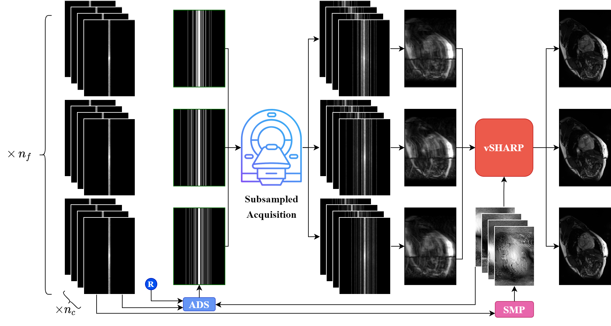
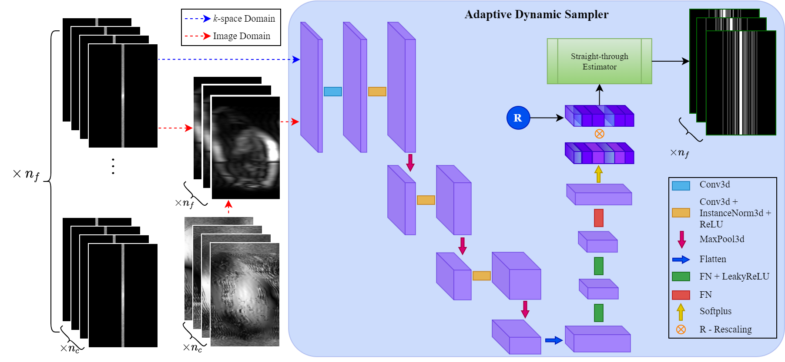

=================================================================================
End-to-End Co-Optimization of Adaptive :math:`k`-Space Sampling and
Reconstruction for Dynamic MRI
=================================================================================

This folder contains configuration files for reproducing experiments from:

`End-to-End Co-Optimization of Adaptive k-space Sampling and Reconstruction for
Dynamic MRI <https://proceedings.mlr.press/v315/yiasemis26a.html>`__
(Yiasemis et al., MIDL 2026, PMLR 315).

* `PMLR proceedings <https://proceedings.mlr.press/v315/yiasemis26a.html>`__
* `OpenReview <https://openreview.net/forum?id=0yrf87zVf2>`__
* Related earlier work: `arXiv:2403.10346 <https://arxiv.org/abs/2403.10346>`__

The paper jointly trains an adaptive :math:`k`-space sampling policy with a
reconstruction network so that acquired lines or pixels are chosen to maximize
image quality under a fixed acceleration budget. Sampling may be **static**
(shared across frames) or **dynamic** (per temporal / slice frame), in **1D**
(phase-encode lines) or **2D** (Cartesian locations). Gradients flow from the
reconstruction loss through the sampler via a straight-through estimator.

Paper overview
==============

   Method overview. ACS / init measurements condition a sampling policy that
   proposes a binary undersampling mask; masked multi-coil :math:`k`-space is
   reconstructed by an unrolled network. The reconstruction loss trains both
   the reconstructor and the sampler end-to-end.

   Adaptive sampler. A convolutional / MLP policy maps partially observed
   :math:`k`-space to per-location probabilities, which are budgeted and
   binarized into a sampling mask.

In DIRECT this is not hard-coded to one reconstructor: any model that goes
through ``MRIModelEngine.perform_sampling`` can attach a sampler under
``additional_models.sampling_model``.

Usage in DIRECT
===============

Enable adaptive sampling by adding a ``sampling_model`` block:

.. code-block:: yaml

   additional_models:
     sampling_model:
       model_name: adaptive.policy.StraightThroughPolicy
       sampling_dimension: ONE_D   # or TWO_D
       sampling_type: STATIC       # or DYNAMIC_2D / DYNAMIC_2D_NON_UNIFORM
       kspace_shape: [512, 246]
       # for DYNAMIC_*:
       # num_time_steps: 11

* ``STATIC`` pairs with 2D reconstruction models.
* ``DYNAMIC_2D`` / ``DYNAMIC_2D_NON_UNIFORM`` pair with 3D / cine models.
* For paper-style per-frame init / ACS masks, set
  ``transforms.dynamic_mask: true``.

Configs in this folder
======================

Configs corresponding to the paper experiments (CMRxRecon cine):

+----------------------------------+---------------+----------------------+
| Config                           | Reconstruction| Sampler              |
+==================================+===============+======================+
| ``vsharp_ads_1d.yaml``            | vSHARP        | ADS 1D static        |
+----------------------------------+---------------+----------------------+
| ``medl_ads_1d.yaml``              | MEDL          | ADS 1D static        |
+----------------------------------+---------------+----------------------+
| ``vsharp_ads_1d_dyn.yaml``        | vSHARP        | ADS 1D dynamic       |
+----------------------------------+---------------+----------------------+
| ``medl_ads_1d_dyn.yaml``          | MEDL          | ADS 1D dynamic       |
+----------------------------------+---------------+----------------------+
| ``vsharp_ads_1d_init2.yaml``      | vSHARP        | ADS 1D + init2       |
+----------------------------------+---------------+----------------------+
| ``medl_ads_1d_init2.yaml``        | MEDL          | ADS 1D + init2       |
+----------------------------------+---------------+----------------------+
| ``vsharp_ads_1d_dyn_init2.yaml``  | vSHARP        | ADS 1D dyn + init2   |
+----------------------------------+---------------+----------------------+
| ``medl_ads_1d_dyn_init2.yaml``    | MEDL          | ADS 1D dyn + init2   |
+----------------------------------+---------------+----------------------+
| ``vsharp_ads_2d.yaml``            | vSHARP        | ADS 2D static        |
+----------------------------------+---------------+----------------------+
| ``medl_ads_2d.yaml``              | MEDL          | ADS 2D static        |
+----------------------------------+---------------+----------------------+
| ``vsharp_ads_2d_dyn.yaml``        | vSHARP        | ADS 2D dynamic       |
+----------------------------------+---------------+----------------------+
| ``medl_ads_2d_dyn.yaml``          | MEDL          | ADS 2D dynamic       |
+----------------------------------+---------------+----------------------+

Naming scheme: ``{recon}_{sampler}_{dim}_{extras}.yaml``

* ``vsharp`` / ``medl`` — reconstruction model
* ``ads`` — straight-through adaptive sampler
* ``1d`` / ``2d`` — sampling dimension
* ``dyn`` — dynamic (per-frame) sampling
* ``init2`` — ACS / target-acceleration initialization variant from the paper

Update dataset ``root`` paths and list files (``.lst``) in each YAML for your
machine before training or inference.

Training and inference
======================

.. code-block:: bash

   direct train <experiment_dir> \
     --cfg projects/e2e_ads_recon/<experiment_name>.yaml \
     --num-gpus <N>

   direct predict <experiment_dir> \
     --checkpoint <path/to/model_*.pt> \
     --cfg projects/e2e_ads_recon/<experiment_name>.yaml \
     --num-gpus <N>

Joint sampling, reconstruction, and registration (companion paper) lives in
``projects/e2e_ads_recon_reg``.
