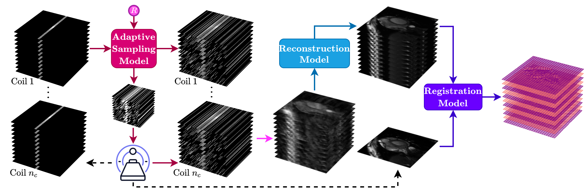
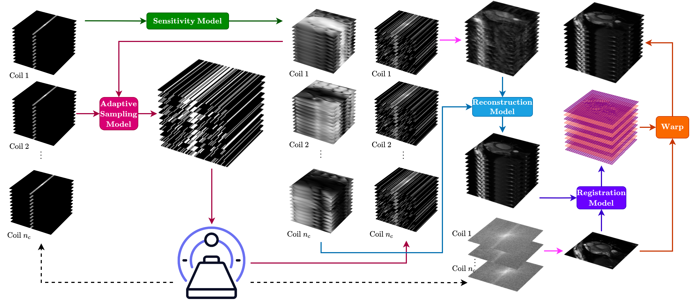
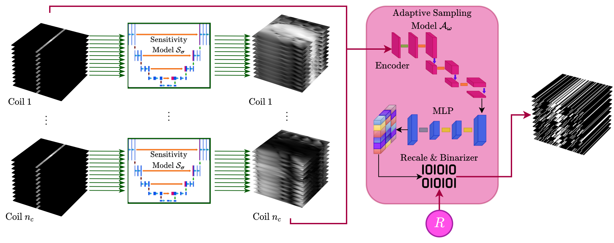
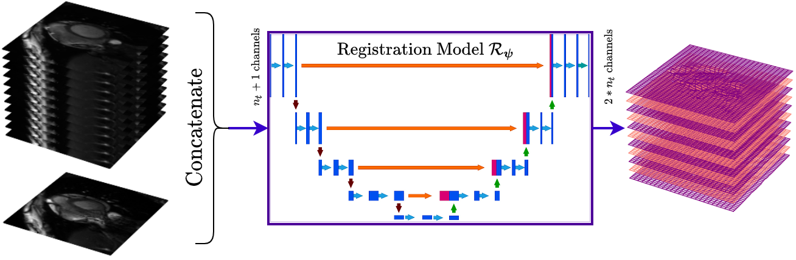

=================================================================================
Deep End-to-End Adaptive k-Space Sampling, Reconstruction, and Registration
=================================================================================

This folder contains configuration files for reproducing experiments from:

`Deep End-to-end Adaptive k-Space Sampling, Reconstruction, and Registration for
Dynamic MRI <https://arxiv.org/abs/2411.18249>`__
(Yiasemis et al., arXiv:2411.18249).

* `arXiv PDF <https://arxiv.org/pdf/2411.18249>`__
* Companion paper (MIDL 2026):
  `End-to-End Co-Optimization of Adaptive k-space Sampling and Reconstruction
  for Dynamic MRI <https://proceedings.mlr.press/v315/yiasemis26a.html>`__
  (also ``projects/e2e_ads_recon``)

The method extends end-to-end adaptive sampling and reconstruction with a
registration network that aligns reconstructed cine frames to a reference
cardiac phase. Sampling, reconstruction, and registration can be trained
**jointly** (gradients through recon to sampler) or in a **disjoint** /
stage-wise fashion (``train_end_to_end: false``).

Paper overview
==============

   Method overview. Undersampled dynamic multi-coil :math:`k`-space is sampled
   by an adaptive policy, reconstructed, then registered to a reference frame
   so that image quality and motion alignment are optimized together.

   Full pipeline. ACS / init mask to sampling policy to reconstruction network
   to registration network, which predicts a displacement field and warps the
   moving frames onto the reference.

   Adaptive sampler (same ADS family as ``projects/e2e_ads_recon``): static or
   dynamic 1D line sampling with a straight-through policy.

   Registration model. A U-Net (default in the released configs) predicts a
   dense displacement field; photometric and smoothness losses supervise
   warping of reconstructed moving frames onto the reference.

Usage in DIRECT
===============

Assemble the pipeline with optional ``additional_models``:

1. ``sampling_model`` — adaptive / dynamic adaptive :math:`k`-space sampler
2. ``model`` — any DIRECT 2D / 3D reconstruction network
3. ``registration_model`` — DL registration (U-Net / VoxelMorph / ViT) or
   classical (Demons / optical flow)

.. code-block:: yaml

   additional_models:
     sampling_model:
       model_name: adaptive.policy.StraightThroughPolicy
       sampling_dimension: ONE_D
       sampling_type: DYNAMIC_2D
       kspace_shape: [512, 246]
       num_time_steps: 11
     registration_model:
       model_name: registration.registration.UnetRegistration2dModel
       train_end_to_end: true
       decoupled_training: false
       rec_loss_factor: 1.0
       reg_loss_factor: 1.0
       max_seq_len: 11

Enable registration transforms under each dataset:

.. code-block:: yaml

   transforms:
     registration:
       registration: true
       registration_simulate_reference: FROM_KEY
       registration_simulate_reference_from_key_index: 6
       registration_estimate_displacement: false
     use_acs_as_mask: true

``MRIModelEngine`` runs sampling then reconstruction; when ``ndim == 3`` and a
``registration_model`` is present it also runs registration and adds the
corresponding losses. Engines that override ``_do_iteration`` (vSHARP, CIRIM,
RIM, MEDL) use the same hooks.

Configs in this folder
======================

Configs corresponding to the paper experiments (CMRxRecon cine):

.. list-table::
   :header-rows: 1
   :widths: 45 30 25

   * - Config
     - Recon / sampler
     - Registration
   * - ``vsharp_ads_1d_reg.yaml``
     - vSHARP + ADS 1D
     - joint U-Net
   * - ``varnet_ads_1d_reg.yaml``
     - VarNet + ADS 1D
     - joint U-Net
   * - ``vsharp_ads_1d_dyn_reg.yaml``
     - vSHARP + ADS dyn
     - joint U-Net
   * - ``varnet_ads_1d_dyn_reg.yaml``
     - VarNet + ADS dyn
     - joint U-Net
   * - ``vsharp_ads_1d_init_reg.yaml``
     - ADS + init
     - joint U-Net
   * - ``vsharp_ads_1d_dyn_init_reg.yaml``
     - ADS dyn + init
     - joint U-Net
   * - ``vsharp_fixed_1d_reg.yaml``
     - fixed mask
     - joint U-Net
   * - ``vsharp_fixed_1d_dyn_reg.yaml``
     - fixed dyn mask
     - joint U-Net
   * - ``vsharp_loupe_1d_reg.yaml``
     - LOUPE
     - joint U-Net
   * - ``vsharp_loupe_1d_dyn_reg.yaml``
     - LOUPE dyn
     - joint U-Net
   * - ``vsharp_ads_1d_reg_disjoint.yaml``
     - ADS 1D
     - disjoint
   * - ``vsharp_ads_1d_dyn_reg_disjoint.yaml``
     - ADS dyn
     - disjoint
   * - ``vsharp_ads_1d_init_reg_disjoint.yaml``
     - ADS + init
     - disjoint
   * - ``vsharp_ads_1d_dyn_init_reg_disjoint.yaml``
     - ADS dyn + init
     - disjoint

Naming scheme: ``{recon}_{sampler}_{mode}_reg[_disjoint].yaml``

* ``vsharp`` / ``varnet`` — reconstruction model
* ``ads`` / ``loupe`` / ``fixed`` — sampler family
* ``dyn`` — dynamic sampling; ``init`` — ACS init variant
* ``reg`` — joint registration; ``disjoint`` —
  ``train_end_to_end: false``

Update dataset ``root`` paths and list files in each YAML for your machine
before training or inference.

Training and inference
======================

.. code-block:: bash

   direct train <experiment_dir> \
     --cfg projects/e2e_ads_recon_reg/<experiment_name>.yaml \
     --num-gpus <N>

   direct predict <experiment_dir> \
     --checkpoint <path/to/model_*.pt> \
     --cfg projects/e2e_ads_recon_reg/<experiment_name>.yaml \
     --num-gpus <N>

Training options
================

* ``train_end_to_end: false`` — detach reconstruction before registration
  (disjoint / stage-wise ablations in the paper).
* ``decoupled_training: true`` — alternate reconstruction and registration
  backward passes.
* ``reg_loss_on_target: true`` — also warp the ground-truth moving image
  (``target``) with the predicted displacement field.
* Classical registration (Demons, optical flow) has no trainable parameters;
  only reconstruction (+ sampler) are optimized.
