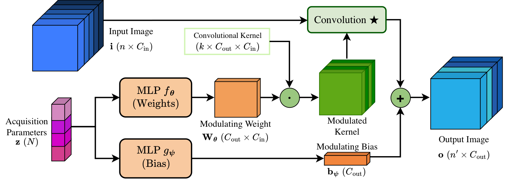
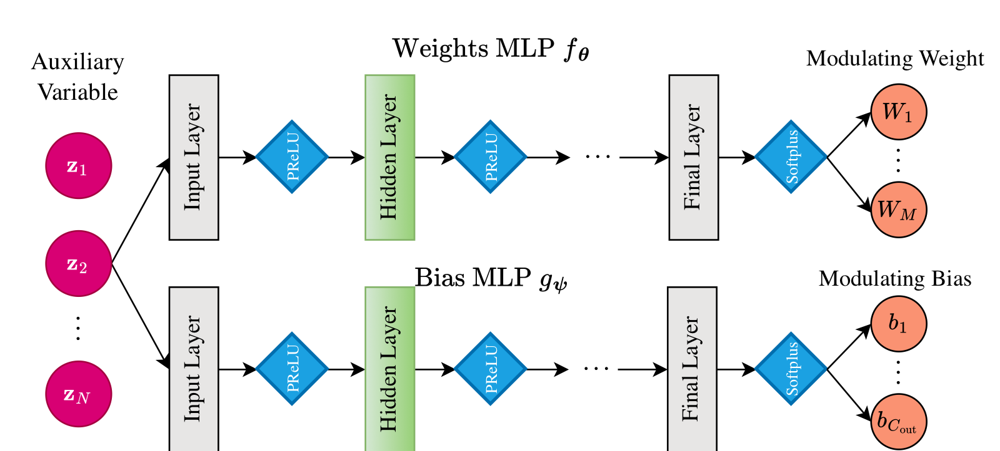
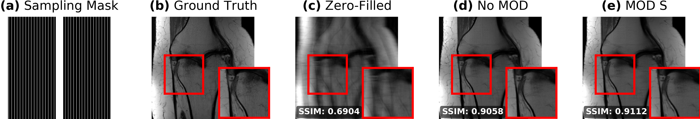

=================================================================================
Modulated Convolution for Conditional MRI Reconstruction
=================================================================================

This folder contains configuration files and a short tutorial for **modulated
convolutions** in DIRECT, as introduced in:

`Conditional Learned Reconstruction for Medical Imaging
<https://proceedings.mlr.press/v315/moriakov26a.html>`__
(Moriakov et al., MIDL 2026, PMLR 315:754–780).

`OpenReview submission (PDF) <https://openreview.net/pdf?id=qNjleGZJis>`__

Modulated convolutions let a reconstruction network adapt its convolutional
filters to **acquisition metadata** (for example acceleration factor and ACS
fraction) via a small MLP. The same backbone can therefore be trained once and
conditioned at inference time on the actual undersampling pattern.

Paper overview
==============

The paper proposes **conditional learned iterative schemes**: convolutional
weights in unrolled reconstruction networks are modulated by learned functions of
acquisition parameters (Section 3, `OpenReview PDF
<https://openreview.net/pdf?id=qNjleGZJis>`__). This addresses variability in
protocol-dependent settings—MRI acceleration and ACS fraction, CT tube current
and projection count—that standard learned iterative models typically do not
model explicitly (Introduction, Section 1).

   **Figure 1** (`paper <https://openreview.net/pdf?id=qNjleGZJis>`__): standard
   convolution vs. modulated convolution. An auxiliary vector
   :math:`\mathbf{z}` (acquisition characteristics) drives MLPs
   :math:`f_\theta, g_\psi` that produce modulating weights and bias; the
   modulated kernel is applied to the input feature maps (Section 3.1, Eq. 6).

   **Figure 2** (`paper <https://openreview.net/pdf?id=qNjleGZJis>`__):
   modulator architecture. The auxiliary variable
   :math:`\mathbf{z} \in \mathbb{R}^N` passes through linear layers with PReLU
   activations; a final Softplus yields modulating weights
   :math:`\mathbf{W} \in \mathbb{R}^{M}` (Section 3.1).

For accelerated MRI, the paper uses (Section 4.3.3, Eq. 7):

.. math::

   \mathbf{z} = \log([R,\; 100 \cdot r_{\mathrm{acs}}]) \in \mathbb{R}^2

where :math:`R` is the acceleration factor and :math:`r_{\mathrm{acs}}` the ACS
fraction. Training samples :math:`R \in [4, 16]` with triangular sampling
toward higher acceleration (Section 4.3.2); equispaced masks are used in the
MRI experiments (Section 4.3.2). Modulated convolutions consistently outperform
non-modulated baselines on fastMRI prostate and knee (Section 4.3.5, Table 1).

   **Figure 3** (`paper <https://openreview.net/pdf?id=qNjleGZJis>`__):
   qualitative knee example at :math:`R = 16`, :math:`r_{\mathrm{acs}} = 0.02`.
   Modulated models recover sharper detail than the non-modulated baseline
   (Section 4.3.5).

DIRECT maps the paper notation to config fields as follows:

+---------------------------+-----------------------------------------------+
| Paper                     | DIRECT config / batch                         |
+===========================+===============================================+
| :math:`\mathbf{z}`        | ``auxiliary_data`` from ``prepare_auxiliary_  |
|                           | data()``                                      |
+---------------------------+-----------------------------------------------+
| :math:`R`                 | ``acceleration`` (batch key)                  |
+---------------------------+-----------------------------------------------+
| :math:`r_{\mathrm{acs}}`  | ``center_fraction`` (batch key)               |
+---------------------------+-----------------------------------------------+
| ``log_aux: true``         | applies :math:`\log` as in Eq. 7              |
+---------------------------+-----------------------------------------------+
| MOD S / M / L MLP sizes   | ``fc_hidden_features: [32, 8]`` etc.          |
| (Section 4.1)             |                                               |
+---------------------------+-----------------------------------------------+
| ``FEATURES`` modulation   | element-wise weight modulation (Section 3.1,  |
|                           | Appendix B.1)                                 |
+---------------------------+-----------------------------------------------+

Overview
========

Standard convolutions use fixed weights. A modulated convolution keeps a base
weight tensor and multiplies it element-wise by an MLP output derived from an
auxiliary vector ``y``:

.. code-block:: text

    x  ──► ModConv2d(·, y) ──► output
              ▲
              │
    y = [log(acceleration), log(100 * center_fraction), ...]

In DIRECT this is implemented as a drop-in replacement for ``torch.nn.Conv2d`` /
``Conv3d`` inside U-Nets, VarNets, vSHARP denoisers, and other unrolled models.

Code layout
===========

All modulated-convolution code lives under ``direct/nn/conv/modulated/``:

``modulated_conv.py``
    Core layers: ``ModConv2d``, ``ModConv3d``, transposed variants, and enums
    ``ModConvType``, ``ModConvActivation``, ``ModConv2dBias``.

``auxiliary_data.py``
    Registry-based auxiliary feature pipeline:

    * ``prepare_auxiliary_data(data, cfg)`` — builds ``(batch, aux_in_features)``
      from the batch dict.
    * ``register_auxiliary_feature()`` — add custom conditioning channels.
    * Default features (in order): ``acceleration``, ``center_fraction``,
      ``field_strength``.

``__init__.py``
    Public re-exports used throughout the codebase.

Related integration points:

* **UNet backbone** — ``direct/nn/unet/unet_2d.py`` swaps ``Conv2d`` blocks for
  ``ModConv2d`` when ``conv_modulation != NONE``.
* **vSHARP** — ``direct/nn/vsharp/vsharp.py`` passes ``auxiliary_data`` to the
  initializer and image denoiser U-Net (Section 3.3).
* **VarNet** — ``direct/nn/varnet/varnet.py`` modulates the regularizer U-Net.
* **Other unrolled models** — KIKINet, JointICNet, IterDualNet, LPD, Conv2d,
  DIDN, MWCNN (see their ``config.py`` files for ``conv_modulation``).
* **Engines** — ``MRIModelEngine._attach_auxiliary_data()`` runs in every supervised,
  SSL, and JSSL iteration. Conv-based engines pass ``auxiliary_data`` into their model
  ``forward``.
* **Data pipeline** — ``direct/data/mri_transforms.py`` enables
  ``return_acceleration`` on mask functions; sampled values land in the batch as
  ``acceleration`` and ``center_fraction``.
* **Triangular acceleration sampling** — set ``linear_range: true`` in masking
  config to match Section 4.3.2 (see ``direct/common/subsample.py``).

Modulation types
================

Set ``conv_modulation`` on model configs to one of:

``NONE``
    Standard convolution (default). Auxiliary inputs are ignored.

``FEATURES``
    MLP output has the same shape as the convolution weight tensor; element-wise
    product with the base weights. Most experiments in this folder use this mode
    (Section 3.1; see also Appendix B.1 for other variants).

``FULL``
    MLP output modulates the full weight tensor (one scalar factor per weight).

``PARTIAL_IN`` / ``PARTIAL_OUT``
    Modulate along input or output channel dimension respectively.

``SUM``
    Learn ``num_weights`` weight bases; MLP produces mixture coefficients.

Key config fields
=================

Model section (example from vSHARP):

.. code-block:: yaml

    conv_modulation: FEATURES      # ModConvType
    aux_in_features: 2             # length of y (paper Eq. 7: R + r_acs)
    auxiliary_features:            # optional; default: first N registry keys
      - acceleration
      - center_fraction
    log_aux: true                  # apply log() as in Eq. 7
    fc_hidden_features: [32, 8]    # MLP hidden layers (MOD S in Section 4.1)
    fc_activation: SOFTPLUS        # SIGMOID or SOFTPLUS (paper: Softplus output)
    fc_groups: 1                   # optional grouped low-rank modulation
    num_weights: null              # only for SUM modulation

Masking section (training with variable acceleration):

.. code-block:: yaml

    masking:
      name: FastMRIEquispaced
      accelerations: [4, 16]
      center_fractions: [0.08, 0.02]
      uniform_range: false
      linear_range: true           # triangular sampling toward higher R (Sec. 4.3.2)

When ``log_aux: true``, ``center_fraction`` is multiplied by 100 before logging
(see ``AuxiliaryFeature.log_scale`` in the registry), matching Eq. 7.
``acceleration`` uses scale 1.

End-to-end data flow
====================

1. **Dataset transform** — ``CreateSamplingMask`` calls the mask function with
   ``return_acceleration=True`` and stores ``acceleration`` / ``center_fraction``
   in the sample dict.
2. **Collate / device** — tensors move to the training device with the batch.
3. **Engine** — ``MRIModelEngine._attach_auxiliary_data()`` calls
   ``prepare_auxiliary_data()`` when modulation is enabled.
4. **Model forward** — each ``ModConv2d`` layer receives ``(x, auxiliary_data)``.

To add a custom auxiliary channel:

.. code-block:: python

    from direct.nn.conv.modulated import AuxiliaryFeature, register_auxiliary_feature

    register_auxiliary_feature(AuxiliaryFeature("my_feature"))
    # then set auxiliary_features: [acceleration, my_feature] in the yaml

Configuration files
===================

Paper experiment configs are in ``projects/modulated_convolution/configs/vsharp/``:

**fastMRI knee** (``configs/vsharp/knee/``, 80k iterations unless noted):

+-------------------------------+-----------------------------------------------+
| Config file                   | Description                                   |
+===============================+===============================================+
| ``vsharp_triang.yaml``        | Baseline vSHARP, no modulation                |
+-------------------------------+-----------------------------------------------+
| ``vsharp_modconv_features_    | FEATURES modulation, MLP ``[32, 32]`` (MOD L) |
| triang.yaml``                 |                                               |
+-------------------------------+-----------------------------------------------+
| ``vsharp_modconv_features_    | FEATURES modulation, MLP ``[32, 8]`` (MOD S)  |
| triang_32_8.yaml``            |                                               |
+-------------------------------+-----------------------------------------------+
| ``vsharp_modconv_features_    | FEATURES modulation, MLP ``[32, 16]`` (MOD M) |
| triang_32_16.yaml``           |                                               |
+-------------------------------+-----------------------------------------------+
| ``vsharp_modconv_features_    | MOD M with ``modulation_at_input: true``,     |
| triang_32_16_mod_inp.yaml``   | 150k iterations                               |
+-------------------------------+-----------------------------------------------+
| ``vsharp_modconv_partial_in_  | PARTIAL_IN modulation, MLP ``[32, 32]``       |
| triang.yaml``                 |                                               |
+-------------------------------+-----------------------------------------------+
| ``vsharp_adain_triang_32_16.  | AdaIN baseline, MLP ``[32, 16]``, 150k iters  |
| yaml``                        |                                               |
+-------------------------------+-----------------------------------------------+

**fastMRI prostate** (``configs/vsharp/prostate/``, 150k iterations):

Same variants as knee except AdaIN and modulation-at-input configs (knee-only ablations).

Other example configs:

``varnet_prostate_modconv_accel_16_16.yaml``
    End-to-end VarNet on prostate. Acceleration-only conditioning
    (``aux_in_features: 1``), MLP ``[16, 16]``.

Training
========

Create an experiment directory, copy or symlink a config as ``config.yaml`` inside it
(or pass ``--cfg`` explicitly). Then:

.. code-block:: bash

    direct train /path/to/experiments/my_run \
        --cfg projects/modulated_convolution/configs/vsharp/knee/vsharp_modconv_features_triang_32_8.yaml \
        --training-root /path/to/fastmri/knee/ \
        --validation-root /path/to/fastmri/knee/val/ \
        --device mps

Prostate (training and validation roots are the same directory):

.. code-block:: bash

    direct train /path/to/experiments/my_run \
        --cfg projects/modulated_convolution/configs/vsharp/prostate/vsharp_modconv_features_triang_32_16.yaml \
        --training-root /path/to/fastmri/prostate/ \
        --validation-root /path/to/fastmri/prostate/ \
        --device mps

Working knee example (matches the Snellius vSHARP mod-conv checkpoint layout):

.. code-block:: bash

    direct train ./experiments/base_vsharp_modconv_softplus_features_double_MLP_triang_32_8 \
        --cfg projects/modulated_convolution/configs/vsharp/knee/vsharp_modconv_features_triang_32_8.yaml \
        --training-root /path/to/fastmri/knee/ \
        --validation-root /path/to/fastmri/knee/val/ \
        --device mps

Resume from a checkpoint:

.. code-block:: bash

    direct train ./experiments/base_vsharp_modconv_softplus_features_double_MLP_triang_32_8 \
        --cfg ./experiments/base_vsharp_modconv_softplus_features_double_MLP_triang_32_8/config.yaml \
        --training-root /path/to/fastmri/knee/ \
        --validation-root /path/to/fastmri/knee/val/ \
        --device mps \
        --resume

Inference
=========

.. code-block:: bash

    direct predict ./output \
        --cfg projects/modulated_convolution/configs/vsharp/knee/vsharp_modconv_features_triang_32_8.yaml \
        --checkpoint /path/to/model_80000.pt \
        --data-root /path/to/fastmri/knee/val \
        --device cuda:0

The ``inference`` block in each yaml fixes the validation acceleration (default
4×). Edit ``inference.dataset.transforms.masking`` to evaluate other rates.

Tests
=====

Modulated convolution unit tests:

.. code-block:: bash

    pytest tests/tests_nn/modulated_conv_test.py tests/tests_nn/auxiliary_data_test.py

Subsampling / triangular range tests:

.. code-block:: bash

    pytest tests/tests_common/subsample_test.py -k "linear_range or equispaced"

Citing this work
================

.. code-block:: BibTeX

    @inproceedings{moriakov2026conditional,
        title     = {Conditional Learned Reconstruction for Medical Imaging},
        author    = {Moriakov, Nikita and Yiasemis, George and Sonke, Jan-Jakob and Teuwen, Jonas},
        booktitle = {Proceedings of The 9th International Conference on Medical Imaging with Deep Learning},
        pages     = {754--780},
        year      = {2026},
        volume    = {315},
        series    = {Proceedings of Machine Learning Research},
        publisher = {PMLR},
        url       = {https://proceedings.mlr.press/v315/moriakov26a.html}
    }

    @article{DIRECTTOOLKIT,
        doi = {10.21105/joss.04278},
        url = {https://doi.org/10.21105/joss.04278},
        year = {2022},
        publisher = {The Open Journal},
        volume = {7},
        number = {73},
        pages = {4278},
        author = {George Yiasemis and Nikita Moriakov and Dimitrios Karkalousos and Matthan Caan and Jonas Teuwen},
        title = {DIRECT: Deep Image REConstruction Toolkit},
        journal = {Journal of Open Source Software}
    }

Figures in ``figures/`` are adapted from the paper (`OpenReview PDF
<https://openreview.net/pdf?id=qNjleGZJis>`__); source diagrams:
``modconv.pdf`` and ``modulation.pdf``.
